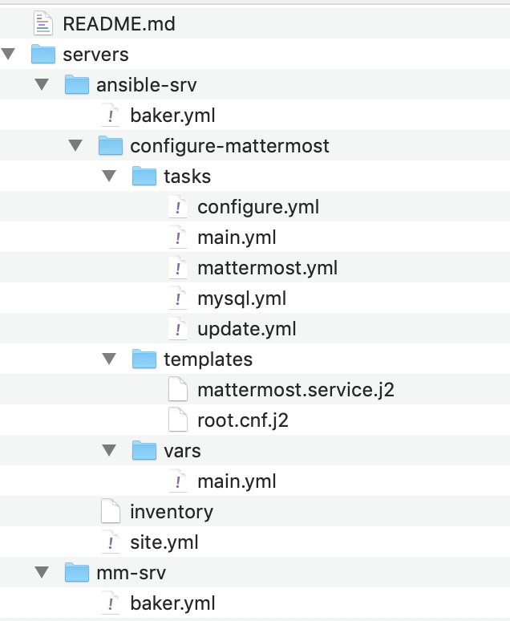
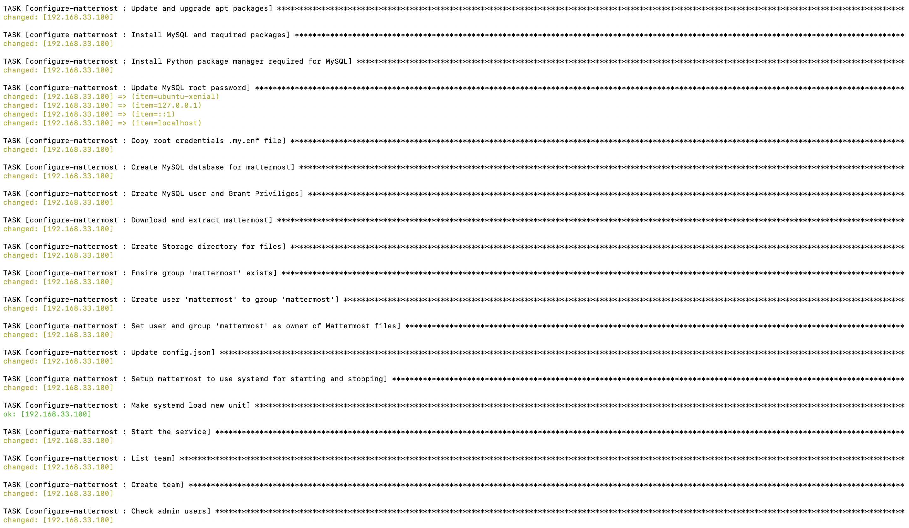
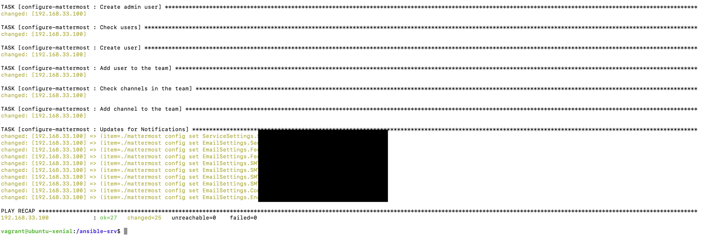
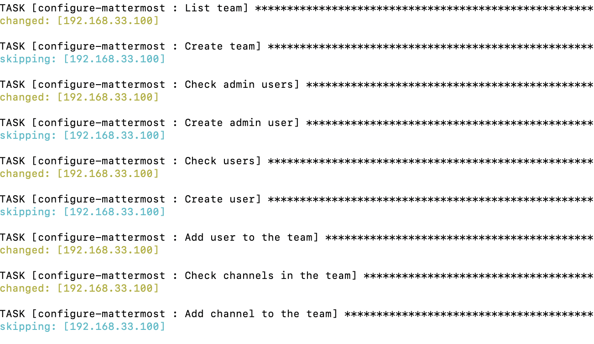
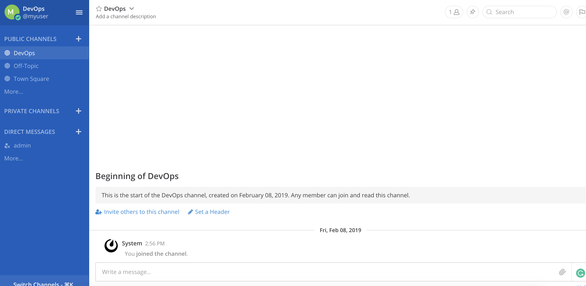

# HW2-DevOps

Name: Vidhisha Jaswani Unity ID: vjaswan

Goal: Using ansible, to be able to automatically configure a server running mattermost.

Instructions: [Mattermost](https://docs.mattermost.com/install/install-ubuntu-1604.html)

## Folder Structure



Here ansible-srv is the configuration server and mm-srv is the server on which we setup Mattermost. The keys are created inside baker.yml of ansible-srv so that we manually do not have to create and place them.

Inside configure-mattermost we have everything required to setup the mattermost server.

```inventory``` file contains the IP, username, and path for private key.

```site.yml``` is the main playbook which will be called.

```configure-mattermost/tasks``` contains all yml files.

```configure-mattermost/templates``` contains files we need to replace on setup.

```configure-mattermost/vars``` contains main.yml with all secrets.


## Replication Instructions

1. Execute the following commands
```
git clone https://github.ncsu.edu/vjaswan/HW2-DevOps-CM.git
cd HW2-DevOps-CM/servers/mm-srv
baker bake
baker ssh
```

2. Open ```HW2-DevOps-CM/servers/ansible-srv/configure-mattermost/vars/main.yml``` and add all your credentials here. Create your SMTP account and add its credentials there too.

3. In another terminal window, execute the following:
```
cd HW2-DevOps-CM/servers/ansible-srv
baker bake
baker ssh
cd /ansible-srv
ansible-playbook -i inventory site.yml
```
4. Open 192.168.33.100:8065 on your browser to see Mattermost running. Login using your admin/myuser username and password which you set in vars/main.yml.


## Outputs

1. The first time we run ```ansible-playbook -i inventory site.yml```





2. The second time we run ```ansible-playbook -i inventory site.yml```



3. Mattermost up and running


## Screencast
[Screencast Link](https://youtu.be/Ld7VZe5MQxY)


## References
1. [Command Line Tools](https://docs.mattermost.com/administration/command-line-tools.html#mattermost-3-6-and-later)
2. [Configuration Settings](https://docs.mattermost.com/administration/config-settings.html)

**Thank you!**
